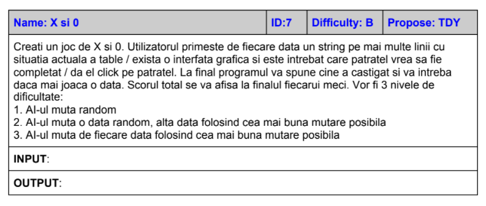
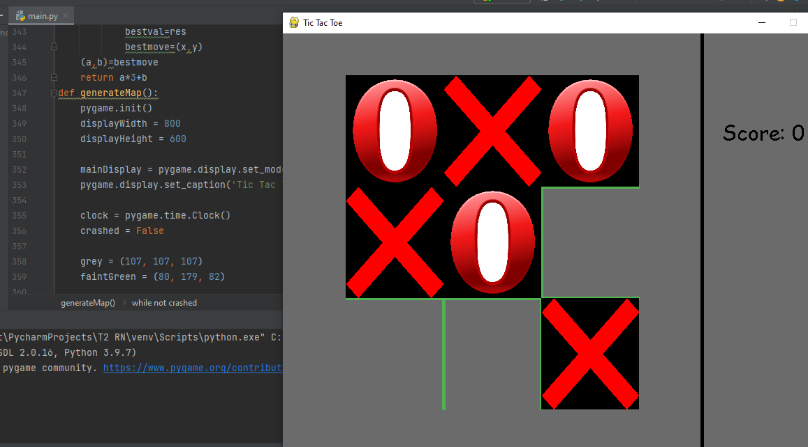

Name: X si 0

ID:7

Enunt: Creati un joc de X si 0. Utilizatorul primeste de fiecare data un string pe mai multe linii cu
situatia actuala a table / exista o interfata grafica si este intrebat care patratel vrea sa fie
completat / da el click pe patratel. La final programul va spune cine a castigat si va intreba
daca mai joaca o data. Scorul total se va afisa la finalul fiecarui meci. Vor fi 3 nivele de
dificultate:
1. AI-ul muta random
2. AI-ul muta o data random, alta data folosind cea mai buna mutare posibila
3. AI-ul muta de fiecare data folosind cea mai buna mutare posibila

INPUT:

OUTPUT:

